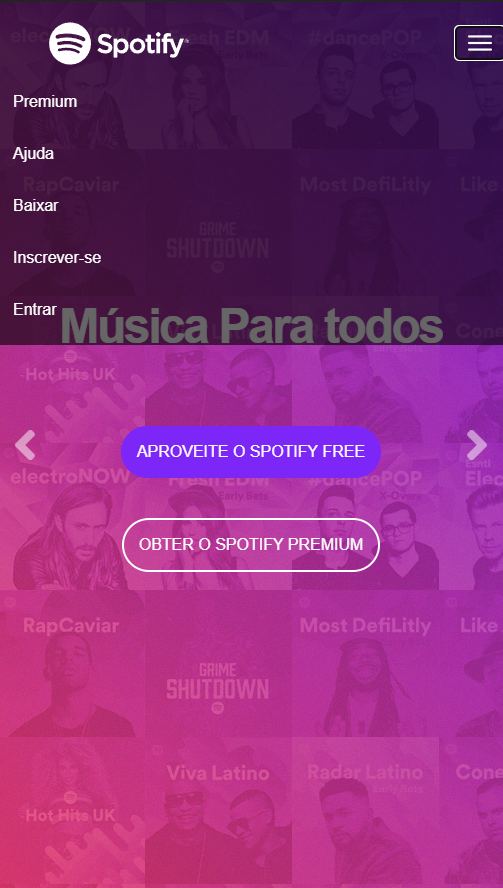
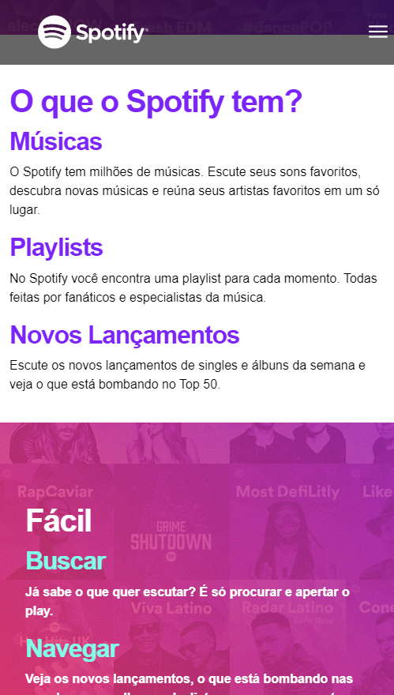

# Clone do Site Spotify

 

 
 

## 👨‍💻 Sobre o projeto:
<a href="https://kauasampaio96.github.io/pj-spotify-front-end/">Hospedagem</a>

   Um clone do site do <b>Spotify</b> onde foi construido a página home página de cadastro, login, além de outras páginas em desenvolvimento 
   Utilizando de Html, Css e Bootstrap para desenvolver a responsividade e efeitos.

 

### 🚀 Tecnologias Utilizadas:

  </img>

